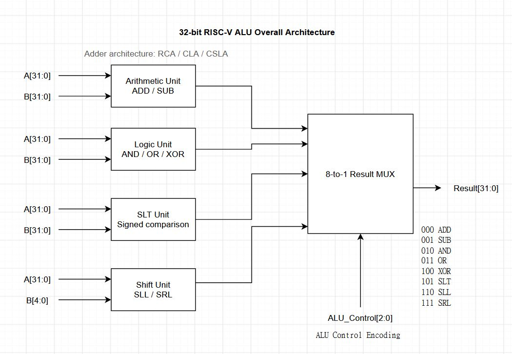
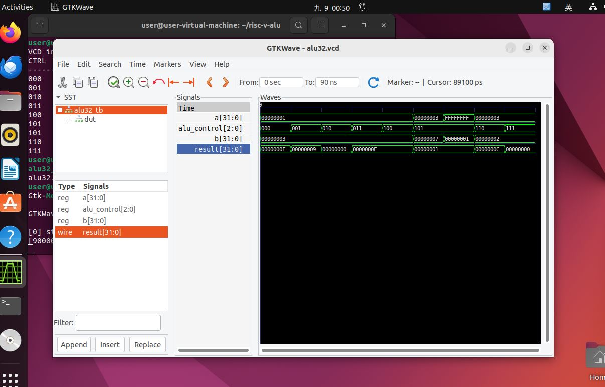
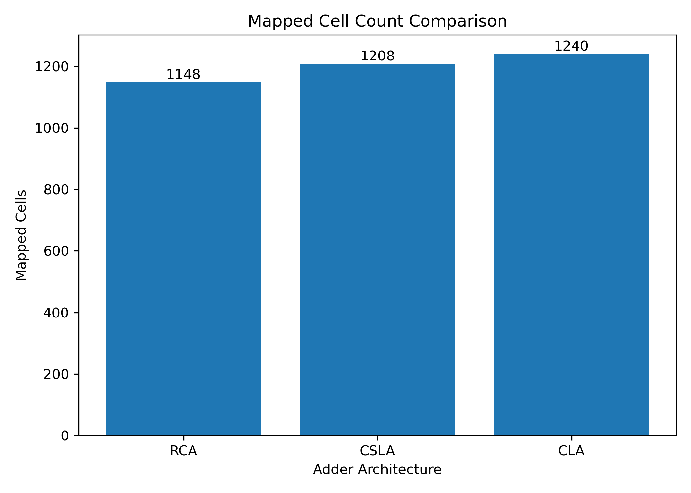
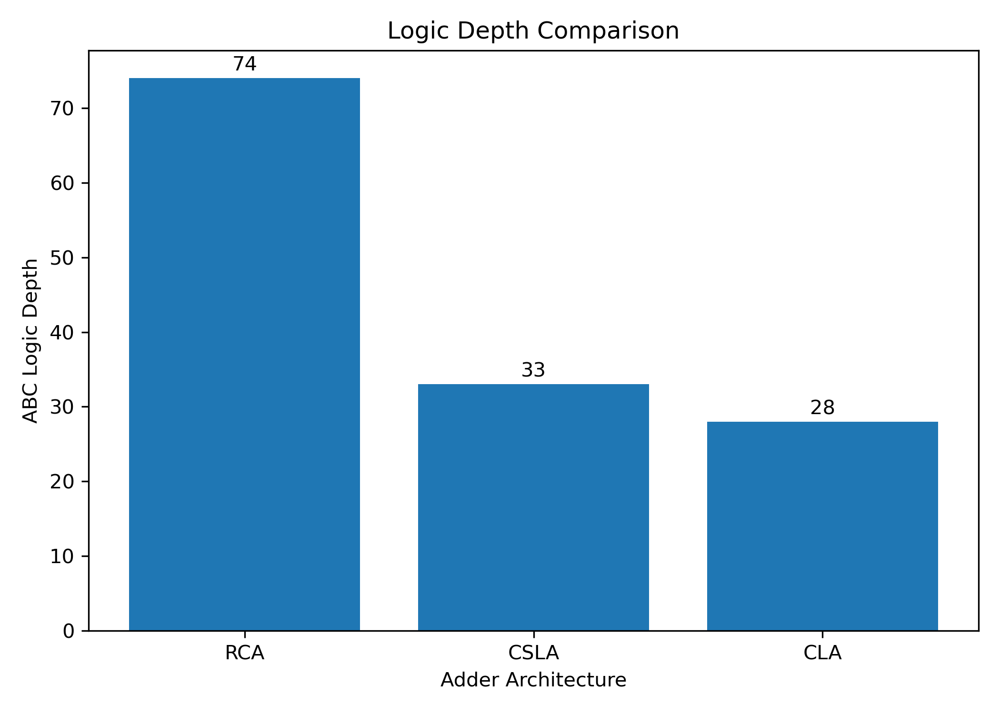

# 32-bit RISC-V ALU Adder Architecture Comparison

This project implements a 32-bit RISC-V ALU and compares three adder architectures:

- Ripple Carry Adder (RCA)
- Carry Lookahead Adder (CLA)
- Carry Select Adder (CSLA)

The goal is to study how the adder architecture affects the hardware cost and structural logic depth of the ALU.

## Supported ALU Operations

The ALU supports the following eight operations:

| ALU Control | Operation |
|---|---|
| 000 | ADD |
| 001 | SUB |
| 010 | AND |
| 011 | OR |
| 100 | XOR |
| 101 | SLT |
| 110 | SLL |
| 111 | SRL |

## Implementation

All designs are written in Verilog.

The three ALU versions use the same top-level logic. The main difference is the adder architecture used in the arithmetic unit.

- RCA: 32-stage full-adder carry chain
- CLA: eight 4-bit CLA blocks
- CSLA: eight 4-bit CSLA blocks with parallel computation for `Cin = 0` and `Cin = 1`

## Architecture



## Verification

Functional verification was performed using:

- Icarus Verilog
- GTKWave

Testbenches were created for both the individual adder modules and the complete 32-bit ALU.

### Simulation Waveform



## Synthesis

The designs were synthesized using:

- Yosys
- ABC

The same synthesis flow and gate set were applied to all three ALU versions.

Two metrics were compared:

- Mapped cell count
- Structural logic depth

## Results

| Architecture | Mapped Cells | Logic Depth |
|---|---:|---:|
| RCA | 1148 | 74 |
| CSLA | 1208 | 33 |
| CLA | 1240 | 28 |

RCA gives the lowest mapped cell count, while CLA gives the lowest structural logic depth. CSLA provides an intermediate result between the two.

### Mapped Cell Count



### Structural Logic Depth



> Note: ABC logic depth is used as a structural proxy and should not be interpreted as an actual timing delay in nanoseconds.

## Project Structure

```text
risc-v-alu/
├── rtl/        # Verilog RTL modules
├── tb/         # Testbenches
├── synth/      # Yosys / ABC scripts
├── results/    # Synthesis and comparison results
├── figures/    # Result plots
├── report/     # Project report
├── README.md
└── .gitignore

## Report

[View the full project report](report/RISC-V_ALU_Adder_Comparison_Report.pdf)
